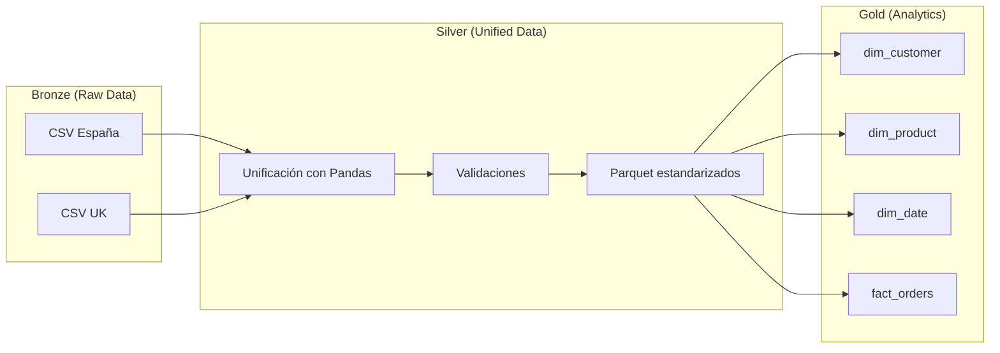

# E-commerce ETL & Analytics (PySpark + Pandas)

Este proyecto forma parte de mi **portafolio profesional** y simula un caso real de **ingeniería de datos** en el sector e-commerce.  
La idea central es responder a una necesidad muy común en las empresas: **integrar y estandarizar información procedente de distintas fuentes y países**, para poder analizar ventas, clientes y productos de manera unificada.  

Para ello he diseñado un **pipeline de datos** que sigue el enfoque **Medallion (Bronze → Silver → Gold)** y que permite transformar datos en crudo en un modelo dimensional listo para analítica y BI.

[Ir a Arquitectura](#arquitectura) · [Como ejecutarlo](#como-ejecutarlo) · [Resultados](#resultados) · [Validaciones](#validaciones-implementadas-silver) · [Esquema](#esquema-silver) · [Estructura](#estructura-del-repositorio) · [Decisiones](#decisiones-de-diseño) · [Limitaciones](#limitaciones-y-supuestos)


## Resumen técnico
- **Bronze** → carga de datasets CSV crudos (España / Reino Unido).  
- **Silver** → unificación con **Pandas** + validaciones, salida en **Parquet estandarizados**.  
- **Gold** → modelado dimensional con **PySpark** (`dim_customer`, `dim_product`, `dim_date`, `fact_orders`).  
- **Output final** → datos optimizados, preparados para ser consumidos desde cualquier herramienta de visualización o BI.

## Arquitectura

### Diagrama del pipeline

## Como ejecutarlo

### 1) Requisitos
- Python 3.12
- Java 11 o 17 (para PySpark, necesario más adelante en la capa Gold)

### 2) Instalar
```bash
python -m venv .venv
source .venv/bin/activate   # En Windows PowerShell: .venv\Scripts\Activate.ps1
pip install -r requirements.txt
```
### 3) Ejecutar (Bronze + Silver)
```bash
# Bronze: ingesta de CSV (ES / UK)
# Silver: unificación con Pandas → Parquet
python -m etl.load_dataset  # o python etl/load_dataset.py si no usas -m
```
### 4) Salida esperada
```bash
data/intermediate/unified/*.parquet
```

## Resultados

Al ejecutar el pipeline (Bronze + Silver), se generan los siguientes ficheros en formato **Parquet**:

### Ejemplo de `orders.parquet`

| global_order_id | global_customer_id | order_id_source | customer_id_source | order_date                | ship_date                 | payment_type     | status     | delivery_method | source_system | shipping_method_id |
|-----------------|--------------------|-----------------|--------------------|---------------------------|---------------------------|------------------|------------|----------------|---------------|--------------------|
| 06e85f416d34    | 2229ba534352       | 1               | 1544               | 2025-04-06T00:00:00.000Z | 2025-04-09T00:00:00.000Z | Transferencia    | Entregado  | recogida       | ES            | SM003              |
| f56000f400fa    | e527ec8362d9       | 2               | 488                | 2025-01-27T00:00:00.000Z | 2025-02-01T00:00:00.000Z | Tarjeta          | Pendiente  | recogida       | ES            | SM003              |
| 1de555fd2e7c    | ce442f85ecf        | 3               | 624                | 2025-04-09T00:00:00.000Z | 2025-04-12T00:00:00.000Z | Tarjeta          | Entregado  | express        | ES            | SM002              |
| a4a3a0e5d23c    | 1d8ad4d1481f       | 4               | 2365               | 2024-11-12T00:00:00.000Z | 2024-11-19T00:00:00.000Z | Transferencia    | Entregado  | recogida       | ES            | SM003              |
| 6451a546ed25    | bc6110c24332       | 5               | 208                | 2024-07-08T00:00:00.000Z | 2024-07-10T00:00:00.000Z | Contra reembolso | Entregado  | recogida       | ES            | SM003              |

### Ejemplo de `customers.parquet`
<details>
  <summary>Visualizar la tabla</summary>
  <div>
  
  | global_customer_id | customer_id | gov_id    | customer_name           | email                      | country | region               | city     | postal_code | address                               | registration_date | deactivation_date     | activation_date       |
  |--------------------|-------------|-----------|-------------------------|----------------------------|---------|----------------------|---------|-------------|---------------------------------------|------------------|-----------------------|-----------------------|
  | 06e854f16d34       | 1           | 48571356W | Nazario Carrasco Solana | feliciano68@example.net    | ES      | La Rioja             | Logroño | 51452       | Cañada Quirino Giner 82 Apt. 79       | 2024-02-13        | 1700-01-01T00:00:00Z | 1700-01-01T00:00:00Z |
  | f5600f400fa        | 2           | 68246664Y | Odalys Sotelo Gil       | imabilbao@example.net      | ES      | Navarra              | Barañain| 30278       | Camino Dani Barrio 983 Apt. 25        | 2024-05-30        | 1700-01-01T00:00:00Z | 1700-01-01T00:00:00Z |
  | 1de555fd2e7c       | 3           | 23489853E | Isaura Carnero          | lilianatorijos@example.org | ES      | Salamanca            | Béjar   | 34447       | Pasaje Eligio Vilanova 17 Puerta 7    | 2025-06-07        | 1700-01-01T00:00:00Z | 1700-01-01T00:00:00Z |
  | a4a3a0e5d23c       | 4           | 13885234L | Porfirio Aitor Priego   | gibertcristina@example.org | ES      | Gipuzkoa             | Donostia| 03968       | Avenida de Camila Barrena 8 Apt. 46   | 2025-01-17        | 2025-03-02T00:00:00Z | 2025-07-05T00:00:00Z |
  | 6451a546ed25       | 5           | 42775624V | Rodolfo Rivera Perelló  | ysanabria@example.com      | ES      | Santa Cruz de Tenerife| Arona   | 06259       | Vía de Gaspar Pozo 123                | 2023-12-31        | 1700-01-01T00:00:00Z | 1700-01-01T00:00:00Z |
  
  </div>

</details>

De esta forma, los datos quedan **unificados y normalizados** para análisis posteriores.  
En siguientes fases (Gold), se generarán **dimensiones y tabla de hechos** para modelado analítico.

## Validaciones implementadas (Silver)

<details>
  <summary>Ver validaciones de categories</summary>

### categories.parquet
- **Columnas obligatorias** por fuente: `ES: ["codigo","nombre"]`, `UK: ["code","name"]`.  
- **Normalización de nombres** → `category_code`, `category_name_es`, `category_name_uk`.  
- **Formato de código de categoría** validado (`check_category_code_format`).  
- **Duplicados**: no se permiten duplicados de `category_code` ni por fuente ni globalmente.  
*Fuente: `etl/core/categories.py`.*

</details>

<details>
  <summary>Ver validaciones de customers</summary>
  
### customers.parquet
- **Columnas obligatorias** por fuente (ids, contacto, localización y fechas).  
- **Normalización de nombres** y limpieza de `email` (trim + lowercase).  
- **Estandarización de país** (`SPAIN` → `ES`).  
- **Formato de documento** (`check_gov_id_format`).  
- **Fechas** a ISO (registro/alta/baja) con soporte de nulos (`date_format(..., nullable=True)` cuando aplica).  
- **Duplicados**: no se permiten en `customer_id` ni `gov_id` por fuente.  
- **ID global**: se genera `global_customer_id` por fuente y se valida **único** global.  
*Fuente: `etl/core/customers.py`.*

</details>

<details>
  <summary>Ver validaciones de orders</summary>

### orders.parquet
- **Columnas obligatorias** por fuente (ids, fechas, estado, entrega).  
- **Normalización de nombres** y creación de `source_system` (`ES`/`UK`).  
- **Fechas** a ISO para `order_date` y `ship_date` (con nulos permitidos si corresponde).  
- **Reglas temporales**:  
  - `order_date` ≤ `ship_date` (`check_order_date`).  
  - **Retraso máximo** de envío: `≤ 20 días` (`check_ship_delay`).  
- **Mapeo** de `delivery_method` a catálogo común (`map_shipping_method`).  
- **IDs globales**: `global_order_id` (pedido) y `global_customer_id` (cliente) mediante `make_id(...)`.  
- **Duplicados**: no se permiten en `global_order_id` (global) ni en `order_id_source` por fuente.  
*Fuente: `etl/core/orders.py`.*

</details>

<details>
  <summary>Ver validaciones de order_items</summary>

### order_items.parquet
- **Columnas obligatorias** por fuente (pedido, producto, cantidad, precio, devuelto).  
- **Normalización de nombres** y creación de `source_system`.  
- **IDs de pedido** re-generados como **globales** con `make_id(...)`.  
- **Precios**:  
  - Limpieza/formato de precio original (`price_format`).  
  - Conversión a EUR (`unit_price_eur`), con `to_euro(..., "GBP")` para UK.  
- **Secuencia por pedido**: `line_number = 1..n` (orden de ítems en cada pedido).  
- **Tipos**: `quantity` y `line_number` a enteros.  
- **Duplicados**: no se permiten pares `(order_id, line_number)` a nivel global.  
*Fuente: `etl/core/order_items.py`.*

</details>

<details>
  <summary>Ver validaciones de products</summary>

### products.parquet
- **Columnas obligatorias** por fuente (códigos, categoría, nombre, proveedor, precio).  
- **Normalización de nombres** (columnas ES/UK paralelas).  
- **Formato de `product_code`** validado por fuente.  
- **Precios**: limpieza/formato por fuente (`price_format`).  
- **Duplicados**: no se permiten `product_code` por fuente ni globalmente.  
- **Unificación** por `product_code` (outer merge) con rellenado de faltantes a `NOT_DEFINED`.  
*Fuente: `etl/core/products.py`.*

</details>

## Esquema (Silver)

<details>
  <summary>Ver esquema de customers</summary>

### customers.parquet
- `global_customer_id` — VARCHAR — **PK** global, único y estable.
- `customer_id` — BIGINT — id de la fuente local.
- `gov_id` — VARCHAR — documento identificativo (NIF/NIE, etc.).
- `customer_name` — VARCHAR
- `email` — VARCHAR
- `country` — VARCHAR — catálogo: ES / UK.
- `region` — VARCHAR
- `city` — VARCHAR
- `postal_code` — VARCHAR — mantener como texto (evita perder ceros).
- `address` — VARCHAR
- `registration_date` — TIMESTAMP
- `deactivation_date` — TIMESTAMP (nullable)
- `activation_date` — TIMESTAMP (nullable)

</details>

<details>
  <summary>Ver esquema de orders</summary>

### orders.parquet
- `global_order_id` — VARCHAR — **PK** del pedido.
- `global_customer_id` — VARCHAR — **FK** → customers.global_customer_id.
- `order_id_source` — BIGINT — id de pedido en la fuente local.
- `customer_id_source` — BIGINT — id de cliente en la fuente local.
- `order_date` — TIMESTAMP
- `ship_date` — TIMESTAMP (nullable)
- `payment_type` — VARCHAR — catálogo (Tarjeta, Transferencia, Contra reembolso, …).
- `status` — VARCHAR — catálogo (Pendiente, Enviado, Entregado, …).
- `delivery_method` — VARCHAR — catálogo (recogida, express, estándar, …).
- `source_system` — VARCHAR — ES / UK.
- `shipping_method_id` — VARCHAR

</details>

<details>
  <summary>Ver esquema de categories</summary>

### categories.parquet
- `category_code` — VARCHAR — **PK** de la categoría.
- `category_name_es` — VARCHAR — nombre en español (fuente España).
- `category_name_uk` — VARCHAR — nombre en inglés (fuente Reino Unido).

</details>

<details>
  <summary>Ver esquema de order_items</summary>

### order_items.parquet
- `line_number` — INTEGER — número de línea dentro del pedido.
- `order_id` — VARCHAR — **FK** → orders.global_order_id.
- `product_code` — VARCHAR — **FK** → products.product_code.
- `quantity` — INTEGER — cantidad pedida.
- `original_unit_price` — DOUBLE — precio unitario original (moneda de origen).
- `returned` — BOOLEAN — indica si el ítem fue devuelto.
- `source_system` — VARCHAR — ES / UK.
- `unit_price_eur` — DOUBLE — precio unitario convertido a EUR.

</details>

<details>
  <summary>Ver esquema de products</summary>

### products.parquet
- `product_code` — VARCHAR — **PK** del producto.
- `category_code_es` — VARCHAR — categoría según nomenclatura España (**FK** → categories.category_code).
- `product_name_es` — VARCHAR — nombre del producto en español.
- `supplier_es` — VARCHAR — proveedor en España.
- `unit_price_es` — DOUBLE — precio unitario en EUR (fuente ES).
- `category_code_uk` — VARCHAR — categoría según nomenclatura Reino Unido (**FK** → categories.category_code).
- `product_name_uk` — VARCHAR — nombre del producto en inglés.
- `supplier_uk` — VARCHAR — proveedor en UK.
- `unit_price_uk` — DOUBLE — precio unitario en GBP (fuente UK).

</details>

## Estructura del repositorio

```
ecommerce-etl-dashboard/
├─ data/
│ ├─ raw/{spain, uk}/
│ ├─ intermediate/unified/ # Silver (Parquet)
│ └─ processed/gold/ # Gold (salidas)
├─ etl/
│ ├─ core/{categories.py, customers.py, order_items.py, orders.py, products.py}
│ ├─ steps/{unify_categories.py, unify_customers.py, unify_order_items.py, unify_orders.py, unify_products.py}
│ ├─ utils/{constants.py, currency.py, dates.py, ids.py, mapping.py, paths.py, validate.py}
│ └─ load_dataset.py # Bronze + Silver
├─ etl_gold/
│ ├─ {config/, core/, steps/}
│ └─ runner.py
├─ sql/
├─ requirements.txt
└─ README.md
```
## Decisiones de diseño
- **Pandas en Silver**: velocidad y simplicidad para unificación ES/UK.
- **PySpark en Gold**: escalabilidad para modelado dimensional y agregados.
- **Medallion** (Bronze → Silver → Gold): separa responsabilidades y facilita testing.
- **Parquet**: formato columnar, compresión y schema-on-read.

## Limitaciones y supuestos
- Los datos son simulados; pueden existir distribuciones no realistas.
- Para evitar nulos en fechas (`activation_date`, `deactivation_date`), se utiliza la fecha **1700-01-01** como valor por defecto.
- Silver mantiene columnas de ambas fuentes (ES/UK) por trazabilidad.

